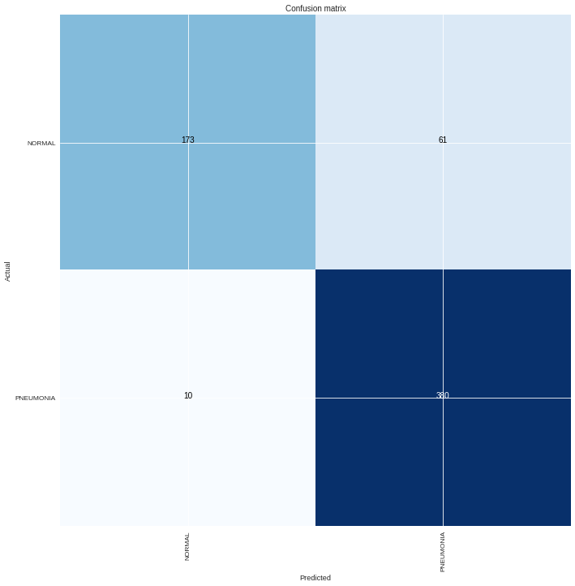

## Introduction
The goal of this project was to build a model that could predict whether or not disease was present in a Chest X-ray using transfer learning in convolutional neural networks.

###### marker of Normal sample vs Pnumonia affected sample

## Data
The dataset is available on [kaggle](https://www.kaggle.com/nih-chest-xrays/data)

## Methodolgy
using grayscaling,resizing, and normalizing images with size 224x224 on the architecture of VGG19 model to build the classifier with bottle neck training only then with training whole network and finally compare results between them.

## Results
this model get **88.7%** accuracy finally after training whole network and below is confusion matrix for two approches,
and we can observe just 8 samples is literaly false because they are pneumonia sample and classified as normal but with other 62 sample they need to double check the diagnosis only. 

**1. bottleneck training**

**2. whole network training**

## Final Thought
I tried resnet101 and densenet 161 architectures and got same results oth this model so I suggest to try another pre-trained model like Xception.

